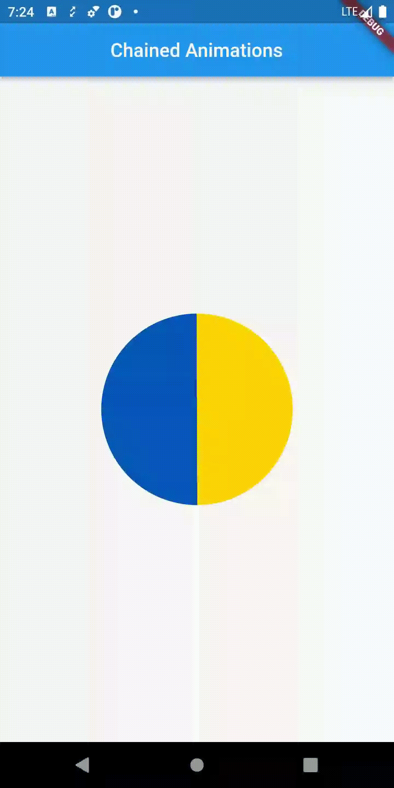

# Flutter Animations Course

I'm watching the course on youtube [playlist](https://www.youtube.com/playlist?list=PL6yRaaP0WPkW3kwAerPeRqGBvJfO8O4S7)  created by [Vandad Nahavandipoor](https://www.youtube.com/@VandadNP)

Original Source Code: [vandadnp/youtube-course-flutter-animations-public](https://github.com/vandadnp/youtube-course-flutter-animations-public)

Welcome to Flutter Animations Course. Animations are an important part of building fluid and modern user interfaces in mobile or web applications. In this course we will talk about the fundamentals of creating animations in Flutter.  

## Course Catalog

| Chapter of Course                                            | Description                                                  | Preview                                                      |
| ------------------------------------------------------------ | ------------------------------------------------------------ | ------------------------------------------------------------ |
| [Introduction to Flutter Animations Course](https://youtu.be/b4ii9QoHfY8?list=PL6yRaaP0WPkW3kwAerPeRqGBvJfO8O4S7) | Introduction to Flutter Animations Course                    |                                                              |
| [Flutter AnimatedBuilder and Transform - Learn the Basics of Animations in Flutter](https://youtu.be/z6KweorVrNk?list=PL6yRaaP0WPkW3kwAerPeRqGBvJfO8O4S7) | In this video we will check out the basics of animations in Flutter and create a simple animation using AnimatedBuilder, Transform, AnimationController and Tween plus Animation. source code: [example1_animatedbuilder_and_transform](./example1_animatedbuilder_and_transform) |  |
| [Flutter Chained Animations, Curves and Clippers - Learn About Chained Explicit Animations in Flutter](https://youtu.be/md1vrcHyxig?list=PL6yRaaP0WPkW3kwAerPeRqGBvJfO8O4S7) | In this video we will check out how chained animations work in Flutter and how we can work with path objects and clippers. source code: [example2_chained_animations](./example2_chained_animations) |  |
| [3D Animations in Flutter - Learn How to Stack and Rotate Widgets for a 3D Effect in Flutter](https://youtu.be/vqrmXhT2HQg?list=PL6yRaaP0WPkW3kwAerPeRqGBvJfO8O4S7) | In this video we will create a 3D animation of a cube with all 6 sides animating in 3 dimensions and talk about the limitations of rendering 3D objects using Flutter's current rendering engine. |                                                              |

